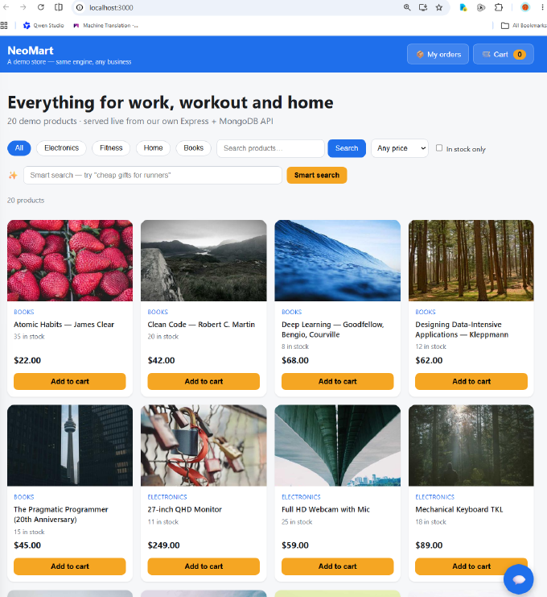
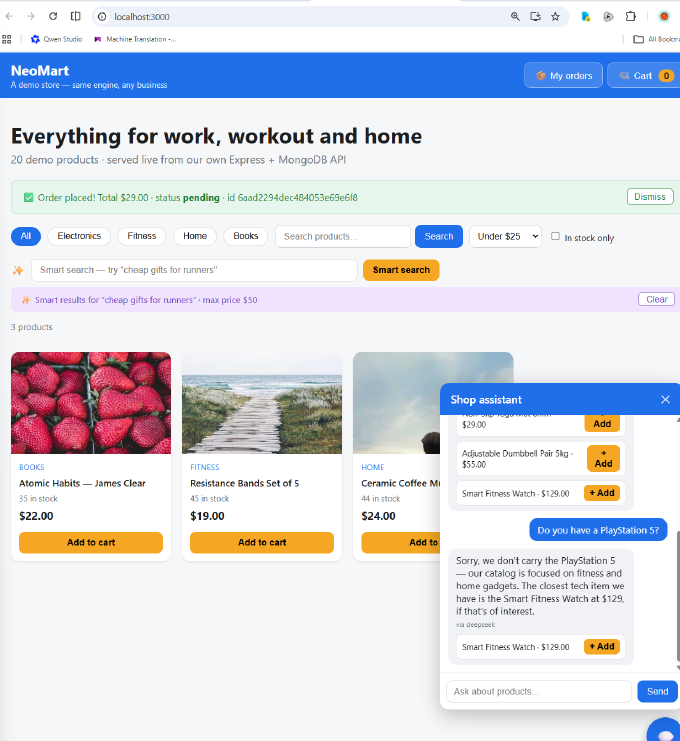

# NeoMart — Full-Stack E-Commerce with an AI Shop Assistant

> A demo store engine — **same engine, any business**. React + Express + MongoDB, with a
> hallucination-resistant AI chatbot and a 3-layer smart search. Built in 7 days as a
> 2026 regeneration of my 2025 AI-powered LMS capstone, reusing its architecture and
> upgrading the AI stack to the 2026 provider landscape.



## Features

- **Storefront** — catalog grid, category pills, text/price/stock filters, cart drawer, checkout, order history with status pills
- **AI shop assistant (RAG-lite)** — answers with real names, prices and stock only; suggests alternatives instead of inventing products; product chips add straight to cart
- **Smart Search (3 layers)** — free regex price intent → weighted keyword scoring → LLM interpretation only when the free layers are weak
- **AI provider chain** — Gemini (free tier, primary) → DeepSeek (fallback) → Smart Mock (offline, always answers). 5-minute response cache; per-provider usage stats at `GET /api/ai/stats`
- **Engineering discipline** — `{ success, count, data }` envelope everywhere; 400/404/409 semantics; server-computed order totals; idempotent seed script; double-submit lock on checkout; startup banner with live data check

## Architecture

```
Browser — React (CRA, :3000)            ← "Tables"
   │  proxy /api →
Express API (:5000)                     ← "Kitchen"
   ├─ routes/   products · orders · users · ai
   ├─ services/ aiService (provider chain + cache + stats)
   └─ config/   MongoDB connection
MongoDB local (:27017, db: ecommerce)   ← "Pantry"
```

## The AI design (the interesting part)

### RAG-lite anti-hallucination
The LLM never sees the whole catalog. The backend pre-filters MongoDB by keywords,
injects only those real products (name/price/stock) into the system prompt, and demands
structured output `{"reply":"...","productIds":[...]}`. The backend then filters the
returned IDs against the real candidates — the model *can't* quote a fake price because
it never had one. Ask it for a PlayStation 5 and it honestly declines, then suggests a
real in-stock alternative.

### 3-layer Smart Search — cheapest intelligence first
1. **Regex** extracts price intent (`under $50`, "cheap" → cap 50) — free
2. **Weighted scoring** (tags +3, name +2, category +2, description +1) — free
3. **LLM interpretation** maps the query to categories/keywords — *only* when layers 1–2 return weak results

"cheap gifts for runners" costs $0 of LLM tokens: the price cap and the `gift` tag do all the work.

### Provider chain + cache
`Gemini → DeepSeek → Smart Mock`, each provider a config entry (model name lives in
`.env`, never hardcoded). Quota/auth failures fall through automatically — the demo never
dies on stage. Identical prompts are served from a 5-minute in-memory cache (key =
catalog + message, so a stock change busts the cache).




## Quick start

Prereqs: Node 22+, local MongoDB running.

```powershell
git clone https://github.com/StanleyNeo/capstone-project-sk-ecommerce.git
cd capstone-project-sk-ecommerce
npm install
copy .env.example .env        # AI keys optional — Smart Mock works keyless
node data/seed.js             # 20 products / 3 users / 5 orders
node backend/src/server.js    # API on :5000 — watch the startup banner

cd frontend
npm install
npm start                     # storefront on :3000
```

Demo login: `demo@shop.test` (seeded). Checkout is simulated — no payments (Stripe test mode is on the roadmap).

## API reference

| Method | Endpoint | Notes |
|--------|----------|-------|
| GET | `/api/products` | filters: `category`, `search`, `minPrice`, `maxPrice`, `inStock` |
| GET | `/api/products/:id` | 404 envelope on unknown id |
| POST | `/api/orders` | 400 bad shape · 404 unknown user/product · 409 insufficient stock; server computes total |
| GET | `/api/orders/:userId` | newest first, items populated |
| GET | `/api/users/lookup?email=` | never returns password fields |
| POST | `/api/chatbot/chat` | `{ message }` → `{ reply, products[], provider }` |
| POST | `/api/search/smart` | `{ query }` → products + `meta` (maxPrice, interpretation) |
| GET | `/api/ai/stats` | per-provider success/error counts, cache size |
| GET | `/api/health` | liveness |

## Environment variables

| Key | Purpose | Required |
|-----|---------|----------|
| `MONGO_URI` | e.g. `mongodb://127.0.0.1:27017/ecommerce` | ✅ |
| `PORT` | API port (default 5000) | ✅ |
| `GEMINI_API_KEY` / `GEMINI_MODEL` | primary AI (free tier) | optional |
| `DEEPSEEK_API_KEY` | fallback AI | optional |
| `OPENAI_API_KEY` | second fallback | optional (unused) |

With no keys at all, every AI feature still works via Smart Mock.

## 2025 → 2026 migration notes

- `create-react-app` is deprecated — kept here deliberately for 2025 code reuse; a Vite migration is planned (`import.meta.env.VITE_*`, root `index.html`, proxy in `vite.config.js`)
- DeepSeek retired the `deepseek-chat` alias (2026-07) and `deepseek-v4-flash` (2026-09) — model names are config, so the fix was one `.env` line
- Gemini free tier is Flash-only since Apr 2026
- Gemini 3.x thinking models return **multi-part** responses (`content.parts[]` incl. thought parts) and count reasoning against `maxOutputTokens` — join non-thought parts and budget generously

## Verification highlights (tested during the build)

- Filters: electronics→5, `yoga`→1, ≤$25→3, out-of-stock→1
- Order for 1 Yoga Mat + 2 Resistance Bands = server-computed **$67.00**, stock decremented atomically, double-submit blocked by a `useRef` lock
- 409 surfaced as a friendly red box: `Insufficient stock for "Smart Fitness Watch": requested 10, available 9`
- Chatbot cache: fresh call ~2–9s → cache hit ~8ms

## Roadmap

- **Day 8a** — Vite migration
- **Day 8b** — Stripe test-mode payments + PayNow QR (zero-fee, Singapore)
- **Phase 2** — self-hosting on Synology DS223j NAS
- **Phase 3** — public demo: Vercel (frontend) + Render (API) + MongoDB Atlas

## Reuse this engine

The whole store rebrands from **one file**: `frontend/src/siteConfig.js`
(business name, tagline, currency, colors, categories) plus a new `data/seed.js` catalog.
Rental fleet, property listings, forex-indicator store — same engine, new seed.

## License

MIT — see [LICENSE](LICENSE).